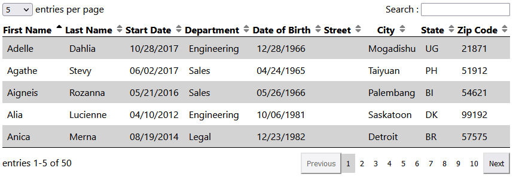
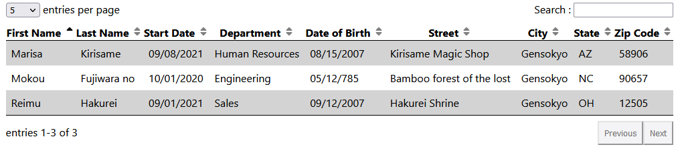

# Custom Tables

A npm package to easily create sortable and searchable data tables as a React component.
[View on npm](https://www.npmjs.com/package/vk-custom-tables)




## Prerequisite

To use it you need to have installed React and React-dom.
It is recommended that you scaffold your React project with a tool like [Create React App](https://create-react-app.dev/) 
or [ViteJs](https://vitejs.dev/).

For information, the examples provided in the repository were bootstrapped using ViteJS

## Installation

In your root folder, with a package.json file run the following command :

`npm install vk-custom-tables`

or with yarn : 

`yarn add vk-custom-tables`

## Usage

```jsx
import {CustomTable} from "vk-custom-tables"
import "vk-custom-tables/dist/Styles/CustomTable.css" 

function YourComponent () {
    //your code
    return (
        //The rest of your JSX
        <CustomTable data={contentData} columns={columnsLabels} />
        //...
    )
}
```

You need to import both the component itself and the stylesheet.

## Format of data

The CustomTable component take in two required props : data and columns.
In order for the data to be displayed correctly, to be sortable and searchable 
it must be correctly formatted.

The columns prop indicate what will appear in the header and which key to look in the data elements. For instance :
```js
const columnsLabels = [
    { title: 'First Name', label: 'firstName' },
    { title: 'Last Name', label: 'lastName' },
    { title: 'Start Date', label: 'startDate' },
    { title: 'Department', label: 'department' },
    { title: 'Date of Birth', label: 'dateOfBirth' },
    { title: 'Street', label: 'street' },
    { title: 'City', label: 'city' },
    { title: 'State', label: 'state' },
    { title: 'Zip Code', label: 'zipCode' }
]
```

Then your data props should be an array of objects with the keys specified in the label values of your column prop :
````js
const contentData = [
    {
        firstName : "Marisa",
        lastName : "Kirisame",
        startDate : "09/08/2021",
        department : "Human Resources",
        dateOfBirth : "08/15/2007",
        street : "Kirisame Magic Shop",
        city : "Gensokyo",
        state : "AZ",
        zipCode : "58906"
    },
    {
        firstName : "Reimu",
        lastName : "Hakurei",
        startDate : "09/01/2021",
        department : "Sales",
        dateOfBirth : "09/12/2007",
        street : "Hakurei Shrine",
        city : "Gensokyo",
        state : "OH",
        zipCode : "12505"
    },
    {
        firstName : "Mokou",
        lastName : "Fujiwara no",
        startDate : "10/01/2020",
        department : "Engineering",
        dateOfBirth : "05/12/785",
        street : "Bamboo forest of the lost",
        city : "Gensokyo",
        state : "NC",
        zipCode : "90657"
    }
]
````
The value of each object in the data array should either be a string or a number. 
A string parseable as a date is also valid, and will be sorted accordingly.

And that's it, you should have your data displayed in a table.



## Importing the data types

If your project is in TypeScript, you can import and use the types for the two 
CustomTable props :

```js
import {CustomTable, ColumnsLabelItem, DataDefaultType} from "vk-custom-tables";

const columnsLabel : ColumnsLabelItem[] = {
    //...
}

const contentData : DataDefaultType[] = {
    //...
}
```

## Side notes

As long as your data is consistent across all element, same format for each date, no missing data, 
using only strings and/or numbers, the table should work correctly : displaying, filtering and sorting.